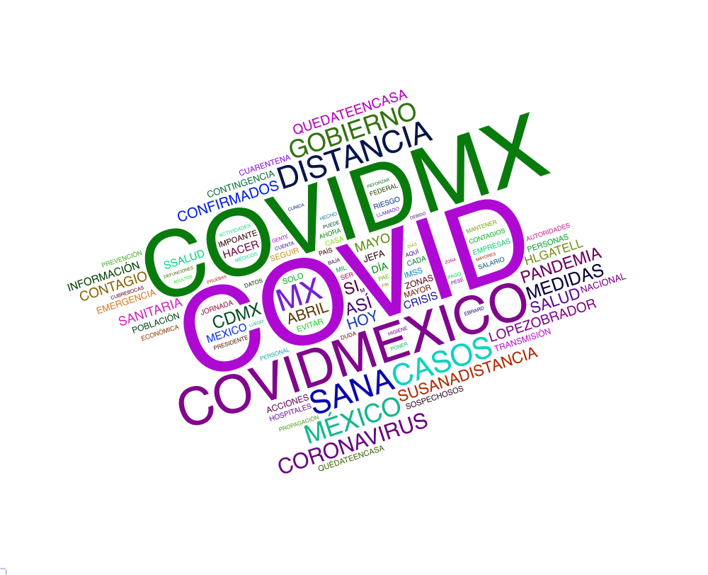

LOREMIPSUM

<center>
<br>
Descargue este reporte en formato estáfico PDF. [AQUÍ](https://github.com/LorenzoLeon/covid19_mex_Reportes/REPORTE_COVID.pdf)
<br>
Descargue el archivo RMarkdown para crear este reporte aquí
[Rmarkdown](https://github.com/LorenzoLeon/covid19_mex_Reportes/REPORTE_COVID.Rmd)
</center>
<br>


# <b>COVID-19 en México</b> {.tabset .tabset-pills}
***
Desde hace un par de semanas, la propagación del virus COVID-19 ha impactado al mundo: desde la forma en la que nos relacionamos cotidianamente, hasta la economía mundial. Ante esta coyuntura, Parametría propone realizar un seguimiento puntual del fenómeno en México en tres frentes: primero, los datos duros respecto al número de casos confirmados; segundo, la opinión pública sobre el fenómeno en sí mismo, así como las medidas en política pública que se han implementado; tercero, un seguimiento en redes sociales acerca de esta discusión pública.
<br>


<div class="pill-nav">
  <a class="active" href='https://lorenzoleon.github.io/covid19_mex_Reportes/'><b>Análisis de Redes Sociales<b></a>
  <a href="#news">News</a>
  <a href="#contact">Contact</a>
  <a href="#about">About</a>
</div>


## Análisis de Redes Sociales
***
<b>Análisis de Sentimiento y Temas</b>
<br>
Con base en una extracción completa de tweets donde se menciona a la figura o tema de importancia analizamos y creamos un diagnóstico de la opinión pública. Basado en un análisis ad hoc de disciplinas mixtas creamos un diccionario especializado para la figura o tema de interés. Este diccionario nos permite crear indicadores de sentimiento o relevancia, capaces de crear sistemas de redes 
<br>
<b>Etapas de Análisis</b>
<br>
Iniciando con una extracción directa de todos los tweets donde hay menciones o utilizan las palabras clave predeterminadas creamos un diagnóstico preliminar. Esta descarga se realiza con interfaces basadas en la API de Twitter, donde filtramos en tiempo real los tweets de interés para crear una base de datos propia analizable.
A partir de este análisis identificamos los topics, hashtags y utilizadores más importantes para el seguimiento. Consideramos poco relevante los seguimientos a tiempo real, dado que es imposible ex ante conocer los futuros temas o tendencias coyunturales. 

### <b>Emojis!</b>
***
Lorem Ipsum
<br>
```{r fig.width=8, fig.height=6, fig.align='center', echo=F, background="white", message = FALSE, warning = FALSE, fig.cap="Emojis más comunes en Tweets sobre COVID-19 en México - Twitter"}
`%notin%` <- Negate(`%in%`)

thead_emojis <- readRDS("01_datos/emojis.rds")

titulo <- "Emojis más usados en tweets con menciones de COVID-19 en Twitter"
ur1 <-  ggplot(thead_emojis%>%distinct(emojis, .keep_all = T), aes(x=emojis, y=`Número de Tweets`, fill = emojis,  label = label, family = family)) + 
  geom_bar(stat = "identity") +
  geom_richtext(label.color = NA, label.padding = grid::unit(rep(0, 4), "pt"),  size = 5, vjust = 1) +
  scale_fill_discrete(NULL, NULL, NULL)+
  labs(title=str_wrap(titulo, width = 70),
       y="Número de tweets",
       x="",
       caption=caption1) +
  theme_minimal()+
  #scale_x_discrete(labels = emojis) +
  theme(axis.title.x=element_blank(),
        axis.text.x=element_blank(),
        axis.ticks.x=element_blank())
ggsave(filename = "03_graficas/04_emojis_twitter.png",plot = ur1,
       width = 15, height = 10, dpi = 100)

subtitulo <- paste0("#COVID19mx Tuits del 15 de marzo al 19 de marzo")
data_emojis <- thead_emojis%>%distinct(emojis, .keep_all = T)
ur2 <- ggplot(data_emojis, 
             aes(x=emojis,
                 y=`Número de Tweets`, fill = emojis,  label = emojis, family = family)) + 
  geom_bar(stat = "identity") +
  geom_text(size = 5, vjust = 1) +
  guides(fill = F)+
  scale_fill_discrete(NULL, NULL, NULL)+
  labs(title=str_wrap(titulo, width = 70),
       y="Número de tweets",
       x="") +
  theme_minimal()+
  #scale_x_discrete(labels = emojis) +
  theme(axis.title.x=element_blank(),
        axis.text.x=element_blank(),
        axis.ticks.x=element_blank(),
        legend.position = "none")

plotly <- plotly::ggplotly(ur2, 
                           tooltip = c("label", "y")
                           )%>%
  plotly::layout(title = list(text = paste0(titulo,
                                    '<br>',
                                    '<sup>',
                                    subtitulo,
                                    '</sup>'),
                              y = 1.1),
                 tickvalues ="", 
                 annotations = list(x = 1, y = 0, 
                                    text = caption, 
                                    showarrow = F, 
                                    xref='paper', 
                                    yref='paper', 
                                    xanchor='right', 
                                    yanchor='auto', 
                                    xshift=0, 
                                    yshift=0,
                                    font=list(size=15, color="red")))
table_format = if(is_html_output()) {
  ur1
} else if(is_latex_output()) {
  plotly
}

```
[Link a esta gráfica](https://lorenzoleon.github.io/covid19_mex_Reportes/Emojis_twitter.html)
<br>


<br>
Es importante hacer un seguimiento de redes Sociales para la comprensión del debate público, principalmente porque, al ser de acceso público, el debate es más cercano a la opinión pública del momento. Este análisis se basa en un scrapping personal de tweets en México que hacen mención de COVID-19. Si bien el sistema no es perfecto (con errores, omisiones e imperfecciones), sirve para tener una buena imagen del debate durante el tiempo.
<br>

## <b>Hashtags, Menciones, Temas</b> {.tabset .tabset-fade .tabset-pills}
***
Lorem Ipsum
<br>

### <b>Temas</b>
***
Esta gráfica indica que la palabras relacionadas con las consecuencias del virus —tales como cuarentena, efecto y casos— son recurrentes en la discusión pública. También cabe destacar que “hoy” fue la palabra más mencionada —con un conteo total de 8,695—, lo anterior sugiere que las y los usuarios de Twitter están preocupados por el seguimiento diario de la evolución del tema.

<br>
<center>

</center>
[Link a esta gráfica](https://lorenzoleon.github.io/covid19_mex_Reportes/WC_topicos_twitter.html)
<br>


